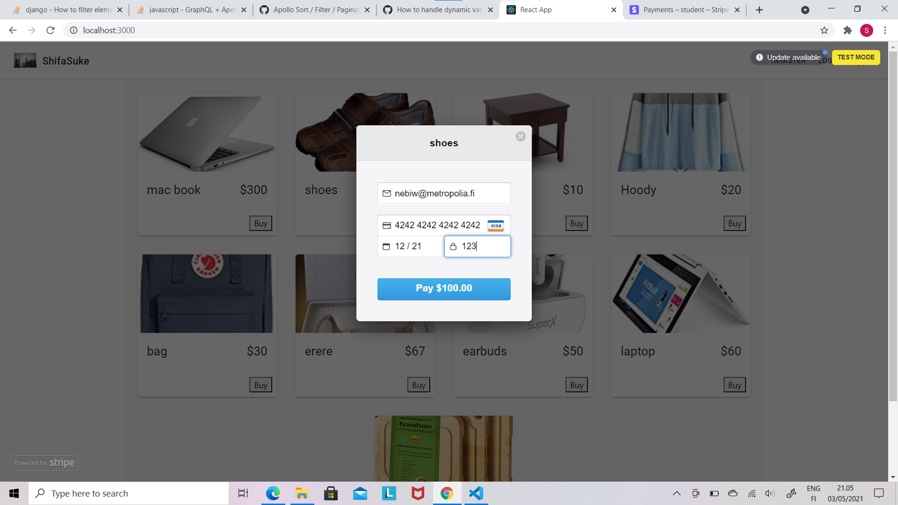
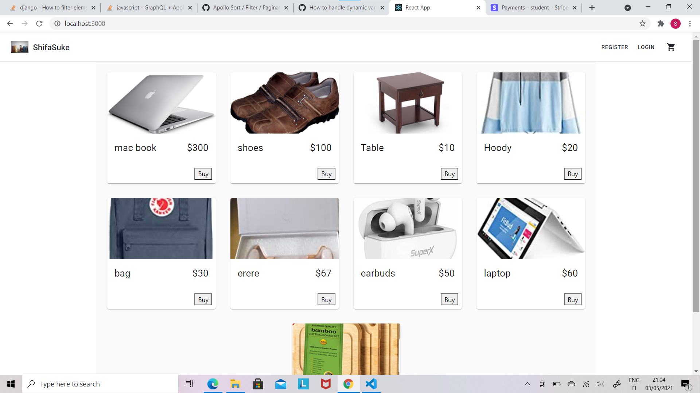
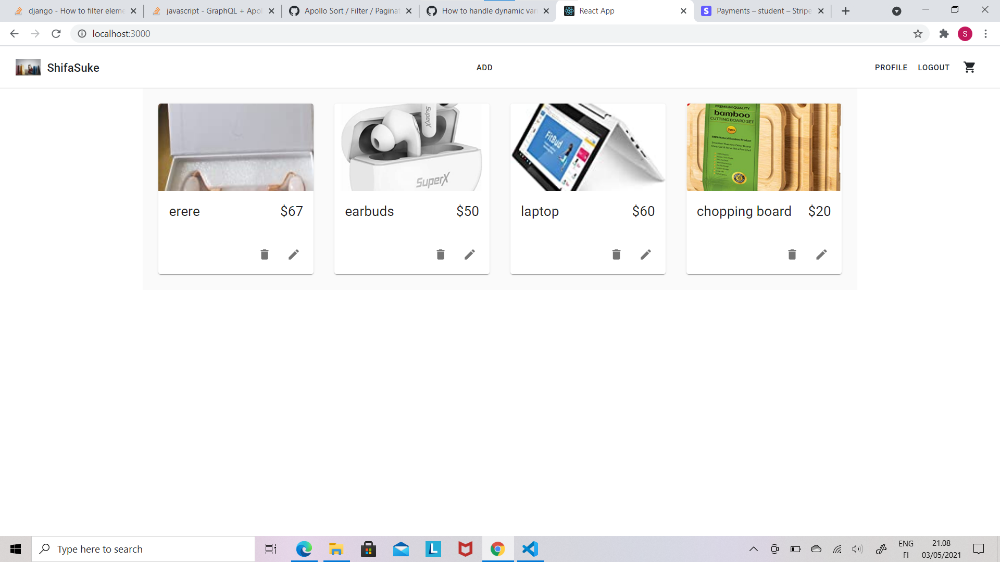

# Shifa-Suk

https://washera.herokuapp.com/ 

# Table of Contents
* Description
* Dependencices Used
* Installation
* Queries Samples
* Questions

## Description

An Ecommerce up for shopping and selling any kind of product using the stripe online payment system.Users can add edit and delete ther products and get all the lists with proper updates. It can be used by anyone or anystore of small sizes. The projectb is build for the fulfuilment of the serverside course.


## Technology Stack

• Node • Express • socket.io • apollo-server-express • graphql • mongoose • passport • stripe • jsonwebtoken • multer • passport-jwt • passport-local • helmet • cors • fs • dotenv

## INSTALLATION 

• Fork this repo and clone to your computer. Next, 'cd server' then run 'npm install' to install all the dependencies listed in package.json file. if any problems try to trun 'npm audit fix'. and finaly run 'nodemon server.js'.


## Login

   ````
   query loginUser($username: String!, $password: String!) {
    loginUser(username: $username, password: $password) {
      token
      user {
        id
        username
        email
      }
    }
  }
  
  ````

## GET_CURRENT_USER

   ````
  query {
    authUserProfile {
      username
      email
      id
    }
  }

 ````

## POST_BY_ID

   ````
  query getPostById($id: ID!) {
    getPostById(id: $id) {
      id
      title
      description
      category
      price
      createdAt
      featureImage
      updatedAt
    }
  }
  
   ````

## GET_All_POSTS

   ````
  query {
    getAllPosts {
      id
      title
      description
      price
      category
      featureImage
      createdAt
      updatedAt
    }
  }
   
   ````


## GET_USER_POSTS

   ````
  query {
    getUserPosts {
      id
      title
      description
      price
      category
      featureImage
      createdAt
      updatedAt
    }
  }
  
   ````


## Get_Post_By_Category

   ````
  query($category: String!) {
    getPostByCategory(category: $category) {
      id
      title
      description
      price
      createdAt
      featureImage
      updatedAt
    }
  }
  
   ````
  
 ## CreateNewPost
 
   ````
  mutation CreateNewPost(
    $title: String!
    $description: String!
    $price: String!
    $category: String!
    $featureImage: [Upload]!
    $id: ID!
  ) {
    createNewPost(
      newPost: {
        title: $title
        description: $description
        price: $price
        category: $category
        featureImage: $featureImage
        author: $id
      }
    ) {
      title
      description
      price
      category
      featureImage
    }
  }

 ````

## REGISTER_NEW_USER

   ````
  mutation registerUser(
    $username: String!
    $email: String!
    $password: String!
  ) {
    registerUser(
      newUser: { username: $username, email: $email, password: $password }
    ) {
      token
      user {
        id
        username
        email
      }
    }
  }
  
   ````


## DELETE_POST_BY_ID

  ````
 mutation deletePostById($id: ID!, $owner: ID!) {
    deletePostById(id: $id, owner: $owner) {
      message
      success
    }
  }
  
   ````


## EDIT_POST_BY_ID

  ````
 mutation updatePost(
    $id: ID!
    $title: String
    $description: String
    $category: String
    $price: String
  ) {
    updatePost(
      post: {
        id: $id
        title: $title
        description: $description
        category: $category
        price: $price
      }
    ) {
      id
    }
  }

 ````


## QUESTIONS

• If you have any questions, concerns or suggestions please feel free to contact me with the link below. GitHub: "nebiw@metropolia.fi"






